# AlienVault OTX (Open Threat Exchange)

https://otx.alienvault.com

## Overview
The [AlienVault Open Threat Exchange (OTX)](https://otx.alienvault.com) is the world’s most authoritative open threat information sharing and analysis network. OTX provides access to a global community of threat researchers and security professionals, with more than 50,000 participants in 140 countries, who contribute over four million threat indicators daily. OTX allows anyone in the security community to actively discuss, research, validate, and share the latest threat data, trends, and techniques.

The OTX community reports on and receives threat data in the form of pulses. An OTX pulse consists of one or more indicators of compromise (IOCs) that constitute a threat or define a sequence of actions that could be used to carry out attacks on networks devices and computers. OTX pulses also provide information on the reliability of threat information, who reported a threat, and other details of threat investigations.

OTX data can be used to enhance the threat detection capabilities, of security monitoring systems such as DNIF.

The OTX platform consists of two chief components:

**Pulses** — Collections of indicators of compromise (IOCs), reported by the OTX community, which other community members review and comment on. Pulses provide you with a summary of the threat, a view into the software targeted, and the related IOCs, reported by the OTX community worldwide.

**IP Reputation** — Provides notification of communication between known malicious hosts and your assets.

### Domain Report

Complete report of all threat indicators for a given domain, including data from all the sub reports. Data returned includes pulse, geo, URL, passive DNS, and WHOIS analysis.

```
_fetch $Domain from testingintegrations limit 1
>>_lookup alienvaultotx get_domain_report $Domain
```

[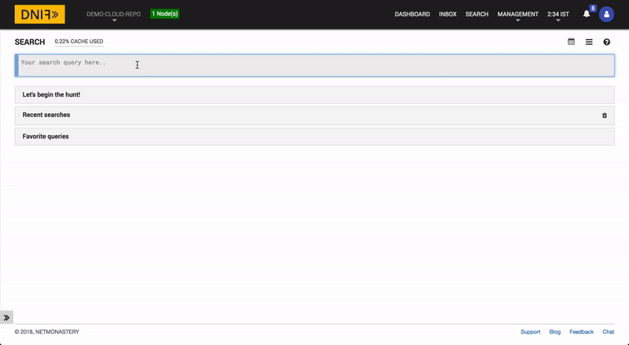](https://youtu.be/9zKyJSq5UpA)

Click the GIF above to view the high resolution video version.

`testingintegrations` is a DNIF event store that can be uploaded for testing. The lookup call returns output in the following structure for available data

|Field|Description|
|-|-|
| $Domain| Domain being queried |
| $AVOTXPulseReferences| List of URLs and website links that were referenced to by individual OTX pulses regarding the given domain |
| $AVOTXPulseCount| Total number of OTX pulses that reference the given domain |
| $AVOTXPulseNames| List of titles given to pulses that reference the given domain |
| $AVOTXPulseTags| List of tags found in OTX pulses that references the given domain |
| $AVOTXPulseTLPs| The TLP color code category of OTX pulses that reference the given domain |
| $AVOTXPulseAuthors| List of names of the authors of the OTX pulses that are included in the returned report |
| $AVOTXGeoCity| City name of the given domain's hosting server |
| $AVOTXGeoRegion| Region name of the given domain's hosting server |
| $AVOTXGeoLatitude| Latitudinal location of the given domain's hosting server |
| $AVOTXGeoLongitude| Longitudinal location of the given domain's hosting server |
| $AVOTXGeoContinentCode| Continent code of the given domain's hosting server |
| $AVOTXGeoCountryName| Country of the given domain's hosting server |
| $AVOTXGeoASNCode| Information about the given domain's geographic ASN code. |
| $AVOTXGeoAreaCode| The area code the given domain's hosting server's are located in |
| $AVOTXGeoPostalCode| The postal code the given domain's hosting server's are located in |
| $AVOTXGeoCountryCode| The country code (2 alphanumeric characters) of the domain's hosting server location |
| $AVOTXMalwareCount| Total number of malware samples analyzed by AlienVault Labs which have been observed connecting to the given domain. |
| $AVOTXMalwareSHA256Hashes| SHA256 hashes of malware files analyzed by AlienVault Labs which have been observed connecting to the given domain. |
| $AVOTXUrlHostnames| Hostnames analyzed by AlienVault Labs on the given domain |
| $AVOTXUrlIPs| List of IP addresses of the URLs on the domain |
| $AVOTXUrlActualSize| Count of the total number of URLs found on the given domain |
| $AVOTXUrls| List of URLs on the domain |
| $AVOTXPassiveDnsIPs| List of passive DNS IP addresses that were observed by AlienVault to be pointing to the given domain |
| $AVOTXPassiveDnsCountries| List of countries whose DNS IP addresses were observed by AlienVault to be pointing to the given domain |
| $AVOTXPassiveDnsCount| Total number of passive DNS IP addresses that were observed by AlienVault to be pointing to the given domain |
| $AVOTXPassiveDnsHostnames| List of hostnames whose hostnames were observed by AlienVault to be pointing to the given domain |
| $AVOTXWhoisCity| WHOIS information about the city the given domain is registered in  |
| $AVOTXWhoisCountry| WHOIS information about the country the given domain is registered in |
| $AVOTXWhoisNameServers| WHOIS information about the domain's official nameservers |
| $AVOTXWhoisDomainName| WHOIS information the official domain name |
| $AVOTXWhoisEmails| WHOIS information about an email registered to the given domain (registrar's emails might be included) |
| $AVOTXWhoisWhoisServer| WHOIS information about the given domain's WHOIS server |
| $AVOTXWhoisDnssec| WHOIS domain name system security extensions (DNSSEC) signature state |
| $AVOTXWhoisRegistrar| WHOIS information about the name of the given domain's official registrar |
| $AVOTXWhoisAddress| WHOIS information about the given domain's official human-world address |
| $AVOTXWhoisState| WHOIS information about the state the given domain is registered in |
| $AVOTXWhoisUpdatedDate| WHOIS information about the last date the WHOIS information was updated |
| $AVOTXWhoisStatus| WHOIS information about the domain status code |
| $AVOTXWhoisReferralUrl| WHOIS information about the domain's referral URL if it exists |
| $AVOTXWhoisZipcode| WHOIS information about the zip code the given domain is registered in |
| $AVOTXWhoisCreationDate| WHOIS information about the given domain's creation date |
| $AVOTXWhoisExpirationDate| WHOIS information about the given domain's expiration date |

### Domain Pulse Report

Threat indicators for the given domain, gathered from the OTX community pulse stream.

```
_fetch $Domain from testingintegrations limit 1
>>_lookup alienvaultotx get_domain_pulse_report $Domain
```

[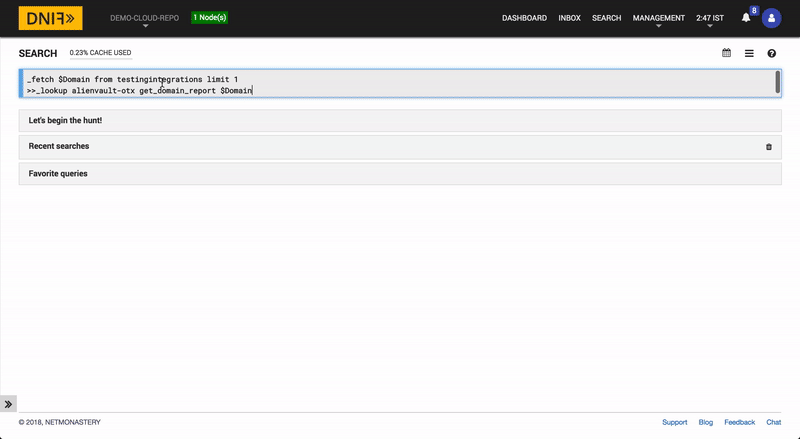](https://youtu.be/TEQPPOrrt10)

Click the GIF above to view the high resolution video version.

`testingintegrations` is a DNIF event store that can be uploaded for testing. The lookup call returns output in the following structure for available data

|Field|Description|
|-|-|
| $Domain| Domain being queried |
| $AVOTXPulseReferences| List of URLs and website links that were referenced to by individual OTX pulses regarding the given domain |
| $AVOTXPulseCount| Total number of OTX pulses that reference the given domain |
| $AVOTXPulseNames| List of titles given to pulses that reference the given domain |
| $AVOTXPulseTags| List of tags found in OTX pulses that references the given domain |
| $AVOTXPulseTLPs| The TLP color code category of OTX pulses that reference the given domain |
| $AVOTXPulseAuthors| List of names of the authors of the OTX pulses that are included in the returned report |
| $AVOTXPulseTargetsCountries| List of countries in the OTX pulses that have been observed to be targeted by this domain's malware |
| $AVOTXPulseTargetsIndustries| List of industries in the OTX pulses that have been observed to be targeted by this domain's malware |

### Domain Geo Report

Registered and inferred geographic information for a given domain (city, country, postal etc).

```
_fetch $Domain from testingintegrations limit 1
>>_lookup alienvaultotx get_domain_geo_report $Domain
```

[](https://youtu.be/t5Hd9yR6GDc)

Click the GIF above to view the high resolution video version.

`testingintegrations` is a DNIF event store that can be uploaded for testing. The lookup call returns output in the following structure for available data

|Field|Description|
|-|-|
| $Domain| Domain being queried |
| $AVOTXGeoCity| City name of the given domain's hosting server |
| $AVOTXGeoRegion| Region name of the given domain's hosting server |
| $AVOTXGeoLatitude| Latitudinal location of the given domain's hosting server |
| $AVOTXGeoLongitude| Longitudinal location of the given domain's hosting server |
| $AVOTXGeoContinentCode| Continent code of the given domain's hosting server |
| $AVOTXGeoCountryName| Country of the given domain's hosting server |
| $AVOTXGeoASNCode| Information about the given domain's geographic ASN code. |
| $AVOTXGeoAreaCode| The area code the given domain's hosting server's are located in |
| $AVOTXGeoPostalCode| The postal code the given domain's hosting server's are located in |
| $AVOTXGeoCountryCode| The country code (2 alphanumeric characters) of the domain's hosting server location |

### Domain Malware Report

Malware samples analyzed by AlienVault Labs which have been observed connecting to the given domain.

```
_fetch $Domain from testingintegrations limit 1
>>_lookup alienvaultotx get_domain_malware_report $Domain
```

[](https://youtu.be/wcd80u6tbeI)

Click the GIF above to view the high resolution video version.

`testingintegrations` is a DNIF event store that can be uploaded for testing. The lookup call returns output in the following structure for available data

|Field|Description|
|-|-|
| $Domain| Domain being queried |
| $AVOTXMalwareCount| Total number of malware samples analyzed by AlienVault Labs which have been observed connecting to the given domain. |
| $AVOTXMalwareSHA256Hashes| SHA256 hashes of malware files analyzed by AlienVault Labs which have been observed connecting to the given domain. |

### Domain URL Report

Report of the URLs analyzed by AlienVault Labs on the given domain.

```
_fetch $Domain from testingintegrations limit 1
>>_lookup alienvaultotx get_domain_url_report $Domain
```

[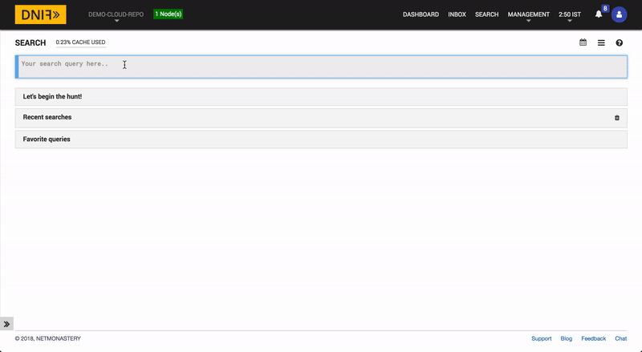](https://youtu.be/h9AD4ZJ4Ml8)

Click the GIF above to view the high resolution video version.

`testingintegrations` is a DNIF event store that can be uploaded for testing. The lookup call returns output in the following structure for available data

|Field|Description|
|-|-|
| $Domain| Domain being queried |
| $AVOTXUrlHostnames| Hostnames analyzed by AlienVault Labs on the given domain |
| $AVOTXUrlIPs| List of IP addresses of the URLs on the domain |
| $AVOTXUrlActualSize| Count of the total number of URLs found on the given domain |
| $AVOTXUrls| List of URLs on the domain |

### Domain Passive DNS Report

Passive DNS records observed by AlienVault to be pointing to the given domain.

```
_fetch $Domain from testingintegrations limit 1
>>_lookup alienvaultotx get_domain_passivedns_report $Domain
```

[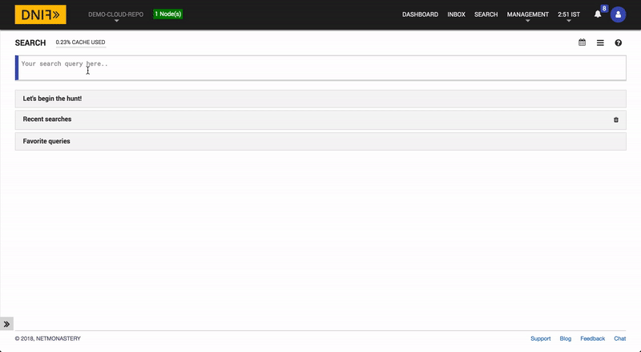](https://youtu.be/-_S_aOA9T4U)

Click the GIF above to view the high resolution video version.

`testingintegrations` is a DNIF event store that can be uploaded for testing. The lookup call returns output in the following structure for available data

|Field|Description|
|-|-|
| $Domain| Domain being queried |
| $AVOTXPassiveDnsIPs| List of passive DNS IP addresses that were observed by AlienVault to be pointing to the given domain |
| $AVOTXPassiveDnsCountries| List of countries whose DNS IP addresses were observed by AlienVault to be pointing to the given domain |
| $AVOTXPassiveDnsCount| Total number of passive DNS IP addresses that were observed by AlienVault to be pointing to the given domain |
| $AVOTXPassiveDnsHostnames| List of hostnames whose hostnames were observed by AlienVault to be pointing to the given domain |

### Domain WHOIS Report

WHOIS data captured for the given domain only (information regarding domains related to the given domain has not been added yet)

```
_fetch $Domain from testingintegrations limit 1
>>_lookup alienvaultotx get_domain_whois_report $Domain
```

[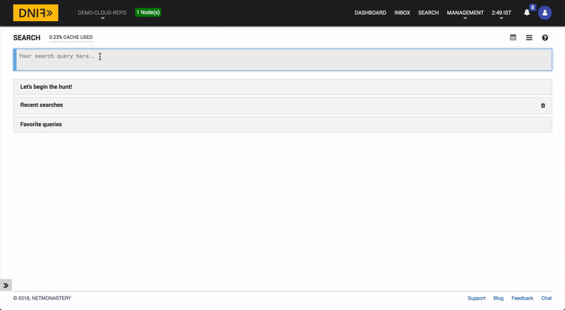](https://youtu.be/D6_FwbG2fso)

Click the GIF above to view the high resolution video version.

`testingintegrations` is a DNIF event store that can be uploaded for testing. The lookup call returns output in the following structure for available data

|Field|Description|
|-|-|
| $Domain| Domain being queried |
| $AVOTXWhoisCity| WHOIS information about the city the given domain is registered in  |
| $AVOTXWhoisCountry| WHOIS information about the country the given domain is registered in |
| $AVOTXWhoisNameServers| WHOIS information about the domain's official nameservers |
| $AVOTXWhoisDomainName| WHOIS information the official domain name |
| $AVOTXWhoisEmails| WHOIS information about an email registered to the given domain (registrar's emails might be included) |
| $AVOTXWhoisWhoisServer| WHOIS information about the given domain's WHOIS server |
| $AVOTXWhoisDnssec| WHOIS domain name system security extensions (DNSSEC) signature state |
| $AVOTXWhoisRegistrar| WHOIS information about the name of the given domain's official registrar |
| $AVOTXWhoisAddress| WHOIS information about the given domain's official human-world address |
| $AVOTXWhoisState| WHOIS information about the state the given domain is registered in |
| $AVOTXWhoisUpdatedDate| WHOIS information about the last date the WHOIS information was updated |
| $AVOTXWhoisStatus| WHOIS information about the domain status code |
| $AVOTXWhoisReferralUrl| WHOIS information about the domain's referral URL if it exists |
| $AVOTXWhoisZipcode| WHOIS information about the zip code the given domain is registered in |
| $AVOTXWhoisCreationDate| WHOIS information about the given domain's creation date |
| $AVOTXWhoisExpirationDate| WHOIS information about the given domain's expiration date |

### Filehash Report

Metadata about the file hash, as well as dynamic and static analysis of the given filehash (SHA1, MD5, or SHA256 acceptable)

```
_fetch $Filehash from testingintegrations limit 1
>>_lookup alienvaultotx get_hash_report $Filehash
```

[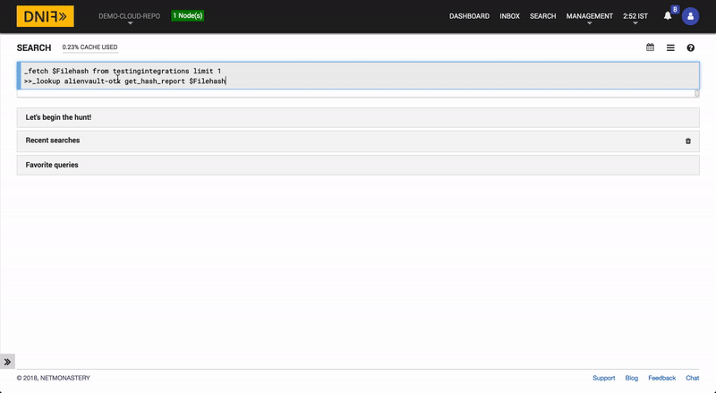](https://youtu.be/RPfJp4Dot_M)

Click the GIF above to view the high resolution video version.

`testingintegrations` is a DNIF event store that can be uploaded for testing. The lookup call returns output in the following structure for available data

|Field|Description|
|-|-|
| $Filehash| The SHA1/MD5/SHA256 file hash being queried |
| $AVOTXAdobeMalwareClassifier| Adobe Malware Classifier result for the given file hash |
| $AVOTXAvast| Avast malware analysis result for the given file hash |
| $AVOTXClamavThreatClassifier| Clamav threat classifier result for the given file hash
| $AVOTXNetworkIPs| List of IP address that this hash's malware file attempts to connect to
| $AVOTXNetworkDomains| List of domains that this hash's malware file attempts to connect to
| $AVOTXFileClass| File class name for the given hash's malware file |
| $AVOTXFileType| File type for the given hash's malware file |
| $AVOTXFilesize| File size of the given hash's malware file in bytes |
| $AVOTXFirstReportDatetime| Timestamp for the first detection of the given file hash's malware file by AlienVault Labs |
| $AVOTXMD5| MD5 hash for the given hash's malware file |
| $AVOTXSHA1| SHA1 hash for the given hash's malware file |
| $AVOTXSHA256| SHA256 hash for the given hash's malware file |
| $AVOTXSsdeep| Ssdeep fuzzy hash for the given hash's malware file |
| $AVOTXSuricataCVE| Suricata provided CVE (Common Vulnerabilities and Exposures) ID for the given hash |
| $AVOTXSuricataCategory| Suricata category for the given hash |
| $AVOTXSuricataDstIP| Suricata provided list of IP addresses that the given hash's malware file attempts to connect to |
| $AVOTXSuricataDstPort| Suricata provided list of ports that the given hash's malware file attempts to connect to |
| $AVOTXSuricataEventCategory| Suricata event category of the given hash's malware file |
| $AVOTXSuricataMalwareName| Suricata provided malware name of the given hash's malware |
| $AVOTXSuricataMalwareSubcategory| Suricata provided subcategory of the given hash's malware |
| $AVOTXSuricataName| Suricata provided name of the given hash's malware |
| $AVOTXVirusTotalPositive| List of threat detection services that matched the given hash to a known malware (via Virus Total) |
| $AVOTXVirusTotalPositive| List of threat detection services that did not match the given hash to a known malware (via Virus Total) |
| $AVOTXVirusTotalSignatures| List of signatures that matched the given hash to a known malware (via Virus Total) |
| $AVOTXVirusTotalTotalChecks| Total number of threat detection services that were queried about the given hash (via Virus Total) |

### URL Report

Historical geographic info, threat indicators gathered from the OTX community pulse stream, and AlienVault Labs URL Analysis results for the given URL

```
_fetch $URL from testingintegrations limit 1
>>_lookup alienvaultotx get_url_report $URL
```

[](https://youtu.be/4at7yzO230o)

Click the GIF above to view the high resolution video version.

`testingintegrations` is a DNIF event store that can be uploaded for testing. The lookup call returns output in the following structure for available data

|Field|Description|
|-|-|
| $URL| The URL being queried without URL query parameters (everything after the last ? is not included in the query) |
| $AVOTXFileMagic| A file magic analysis result of the given URL's destination resource |
| $AVOTXFileType| File type of the given URL's destination resource |
| $AVOTXUrlDomain| Domain name of the resource, extracted from the URL |
| $AVOTXUrlHostname| Hostname of the resource, extracted from the URL |
| $AVOTXGsb| Google Safe Browsing result about the given URL |
| $AVOTXSHA256Hash| SHA256 Hash of the file/resource that the URL points to |
| $AVOTXMD5Hash| MD5 Hash of the file/resource that the URL points to |
| $AVOTXResolvedIP| The IP address of the server that hosts the given URL |
| $AVOTXGeoCity| City name of the given URL's hosting server |
| $AVOTXGeoRegion| Region name of the given URL's hosting server |
| $AVOTXGeoLatitude| Latitudinal location of the given URL's hosting server |
| $AVOTXGeoLongitude| Longitudinal location of the given URL's hosting server |
| $AVOTXGeoContinentCode| Continent code of the given URL's hosting server |
| $AVOTXGeoCountryName| Country of the given URL's hosting server |
| $AVOTXGeoAreaCode| The area code the given URL's hosting server's are located in |
| $AVOTXGeoPostalCode| The postal code the given URL's hosting server's are located in |
| $AVOTXGeoCountryCode| The country code (2 alphanumeric characters) of the URL's hosting server location |
| $AVOTXPulseReferences| List of URLs and website links that were referenced to by individual OTX pulses regarding the given URL |
| $AVOTXPulseCount| Total number of OTX pulses that reference the given URL |
| $AVOTXPulseNames| List of titles given to pulses that reference the given URL |
| $AVOTXPulseTags| List of tags found in OTX pulses that references the given URL |
| $AVOTXPulseTLPs| The TLP color code category of OTX pulses that reference the given URL |
| $AVOTXPulseAuthors| List of names of the authors of the OTX pulses that are included in the returned report |
| $AVOTXPulseTargetsCountries| List of countries in the OTX pulses that have been observed to be targeted by this URL's malware |
| $AVOTXPulseTargetsIndustries| List of industries in the OTX pulses that have been observed to be targeted by this URL's malware |

### Hostname Report

Complete report of all threat indicators for a given hostname, including data from all the sub reports. Data returned includes pulse, geo, URL, passive DNS, and WHOIS analysis.

```
_fetch $Hostname from testingintegrations limit 1
>>_lookup alienvaultotx get_hostname_report $Hostname
```

[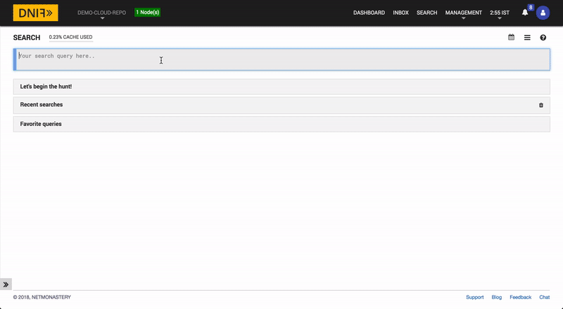](https://youtu.be/Rcp9hFVu23E)

Click the GIF above to view the high resolution video version.

`testingintegrations` is a DNIF event store that can be uploaded for testing. The lookup call returns output in the following structure for available data

|Field|Description|
|-|-|
| $Hostname| Hostname being queried |
| $AVOTXPulseReferences| List of URLs and website links that were referenced to by individual OTX pulses regarding the given hostname |
| $AVOTXPulseCount| Total number of OTX pulses that reference the given hostname |
| $AVOTXPulseNames| List of titles given to pulses that reference the given hostname |
| $AVOTXPulseTags| List of tags found in OTX pulses that references the given hostname |
| $AVOTXPulseTLPs| The TLP color code category of OTX pulses that reference the given hostname |
| $AVOTXPulseAuthors| List of names of the authors of the OTX pulses that are included in the returned report |
| $AVOTXGeoCity| City name of the given hostname's hosting server |
| $AVOTXGeoRegion| Region name of the given hostname's hosting server |
| $AVOTXGeoLatitude| Latitudinal location of the given hostname's hosting server |
| $AVOTXGeoLongitude| Longitudinal location of the given hostname's hosting server |
| $AVOTXGeoContinentCode| Continent code of the given hostname's hosting server |
| $AVOTXGeoCountryName| Country of the given hostname's hosting server |
| $AVOTXGeoASNCode| Information about the given hostname's geographic ASN code. |
| $AVOTXGeoAreaCode| The area code the given hostname's hosting server's are located in |
| $AVOTXGeoPostalCode| The postal code the given hostname's hosting server's are located in |
| $AVOTXGeoCountryCode| The country code (2 alphanumeric characters) of the hostname's hosting server location |
| $AVOTXMalwareCount| Total number of malware samples analyzed by AlienVault Labs which have been observed connecting to the given hostname. |
| $AVOTXMalwareSHA256Hashes| SHA256 hashes of malware files analyzed by AlienVault Labs which have been observed connecting to the given hostname. |
| $AVOTXUrlHostnames| Hostnames analyzed by AlienVault Labs on the given hostname |
| $AVOTXUrlIPs| List of IP addresses of the URLs on the hostname |
| $AVOTXUrlActualSize| Count of the total number of URLs found on the given hostname |
| $AVOTXUrls| List of URLs on the hostname |
| $AVOTXPassiveDnsIPs| List of passive DNS IP addresses that were observed by AlienVault to be pointing to the given hostname |
| $AVOTXPassiveDnsCountries| List of countries whose DNS IP addresses were observed by AlienVault to be pointing to the given hostname |
| $AVOTXPassiveDnsCount| Total number of passive DNS IP addresses that were observed by AlienVault to be pointing to the given hostname |
| $AVOTXPassiveDnsHostnames| List of hostnames whose hostnames were observed by AlienVault to be pointing to the given hostname |

### Hostname Pulse Report

Threat indicators for the given hostname, gathered from the OTX community pulse stream.

```
_fetch $Hostname from testingintegrations limit 1
>>_lookup alienvaultotx get_hostname_pulse_report $Hostname
```

[](https://youtu.be/RsFuaKEcD4g)

Click the GIF above to view the high resolution video version.

`testingintegrations` is a DNIF event store that can be uploaded for testing. The lookup call returns output in the following structure for available data

|Field|Description|
|-|-|
| $Hostname| Hostname being queried |
| $AVOTXPulseReferences| List of URLs and website links that were referenced to by individual OTX pulses regarding the given hostname |
| $AVOTXPulseCount| Total number of OTX pulses that reference the given hostname |
| $AVOTXPulseNames| List of titles given to pulses that reference the given hostname |
| $AVOTXPulseTags| List of tags found in OTX pulses that references the given hostname |
| $AVOTXPulseTLPs| The TLP color code category of OTX pulses that reference the given hostname |
| $AVOTXPulseAuthors| List of names of the authors of the OTX pulses that are included in the returned report |
| $AVOTXPulseTargetsCountries| List of countries in the OTX pulses that have been observed to be targeted by this hostname's malware |
| $AVOTXPulseTargetsIndustries| List of industries in the OTX pulses that have been observed to be targeted by this hostname's malware |

### Hostname Geo Report

Registered and inferred geographic information for a given hostname (city, country, postal etc).

```
_fetch $Hostname from testingintegrations limit 1
>>_lookup alienvaultotx get_hostname_geo_report $Hostname
```

[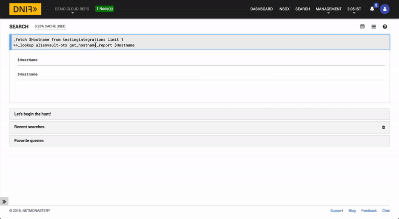](https://youtu.be/-WqHYS6ylio)

Click the GIF above to view the high resolution video version.

`testingintegrations` is a DNIF event store that can be uploaded for testing. The lookup call returns output in the following structure for available data

|Field|Description|
|-|-|
| $Hostname| Hostname being queried |
| $AVOTXGeoCity| City name of the given hostname's hosting server |
| $AVOTXGeoRegion| Region name of the given hostname's hosting server |
| $AVOTXGeoLatitude| Latitudinal location of the given hostname's hosting server |
| $AVOTXGeoLongitude| Longitudinal location of the given hostname's hosting server |
| $AVOTXGeoContinentCode| Continent code of the given hostname's hosting server |
| $AVOTXGeoCountryName| Country of the given hostname's hosting server |
| $AVOTXGeoASNCode| Information about the given hostname's geographic ASN code. |
| $AVOTXGeoAreaCode| The area code the given hostname's hosting server's are located in |
| $AVOTXGeoPostalCode| The postal code the given hostname's hosting server's are located in |
| $AVOTXGeoCountryCode| The country code (2 alphanumeric characters) of the hostname's hosting server location |

### Hostname Malware Report

Malware samples analyzed by AlienVault Labs which have been observed connecting to the given hostname.

```
_fetch $Hostname from testingintegrations limit 1
>>_lookup alienvaultotx get_hostname_malware_report $Hostname
```

[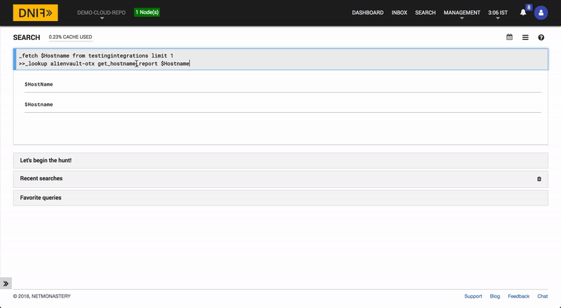](https://youtu.be/BDnrIOhZ8m4)

Click the GIF above to view the high resolution video version.

`testingintegrations` is a DNIF event store that can be uploaded for testing. The lookup call returns output in the following structure for available data

|Field|Description|
|-|-|
| $Hostname| Hostname being queried |
| $AVOTXMalwareCount| Total number of malware samples analyzed by AlienVault Labs which have been observed connecting to the given hostname. |
| $AVOTXMalwareSHA256Hashes| SHA256 hashes of malware files analyzed by AlienVault Labs which have been observed connecting to the given hostname. |

### Hostname URL Report

Report of the URLs analyzed by AlienVault Labs on the given hostname.

```
_fetch $Hostname from testingintegrations limit 1
>>_lookup alienvaultotx get_hostname_url_report $Hostname
```

[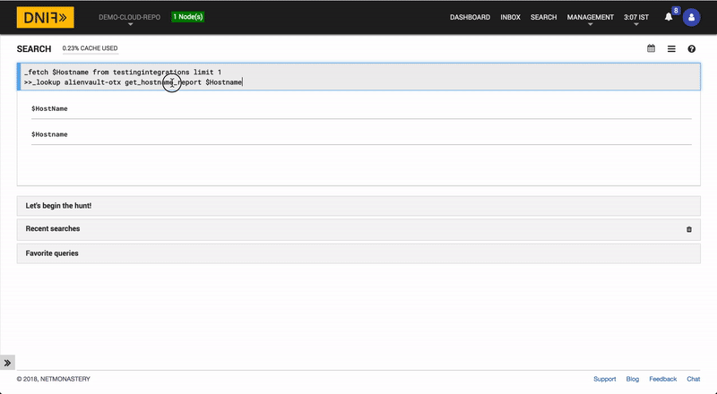](https://youtu.be/qBqdGYLXNMY)

Click the GIF above to view the high resolution video version.

`testingintegrations` is a DNIF event store that can be uploaded for testing. The lookup call returns output in the following structure for available data

|Field|Description|
|-|-|
| $Hostname| Hostname being queried |
| $AVOTXUrlHostnames| Hostnames analyzed by AlienVault Labs on the given hostname |
| $AVOTXUrlIPs| List of IP addresses of the URLs on the hostname |
| $AVOTXUrlActualSize| Count of the total number of URLs found on the given hostname |
| $AVOTXUrls| List of URLs on the hostname |

### Hostname Passive DNS Report

Passive DNS records observed by AlienVault to be pointing to the given hostname.

```
_fetch $Hostname from testingintegrations limit 1
>>_lookup alienvaultotx get_hostname_passivedns_report $Hostname
```

[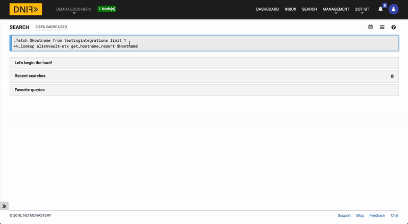](https://youtu.be/Xp9A9KsoAX0)

Click the GIF above to view the high resolution video version.

`testingintegrations` is a DNIF event store that can be uploaded for testing. The lookup call returns output in the following structure for available data

|Field|Description|
|-|-|
| $Hostname| Hostname being queried |
| $AVOTXPassiveDnsIPs| List of passive DNS IP addresses that were observed by AlienVault to be pointing to the given hostname |
| $AVOTXPassiveDnsCountries| List of countries whose DNS IP addresses were observed by AlienVault to be pointing to the given hostname |
| $AVOTXPassiveDnsCount| Total number of passive DNS IP addresses that were observed by AlienVault to be pointing to the given hostname |
| $AVOTXPassiveDnsHostnames| List of hostnames whose hostnames were observed by AlienVault to be pointing to the given hostname |

### IP Report

Complete report of all threat indicators for a given IP, including data from all the sub reports. Data returned includes pulse, geo, URL, passive DNS, and WHOIS analysis.

```
_fetch $SrcIP from testingintegrations limit 1
>>_lookup alienvaultotx get_IP_report $SrcIP
```

[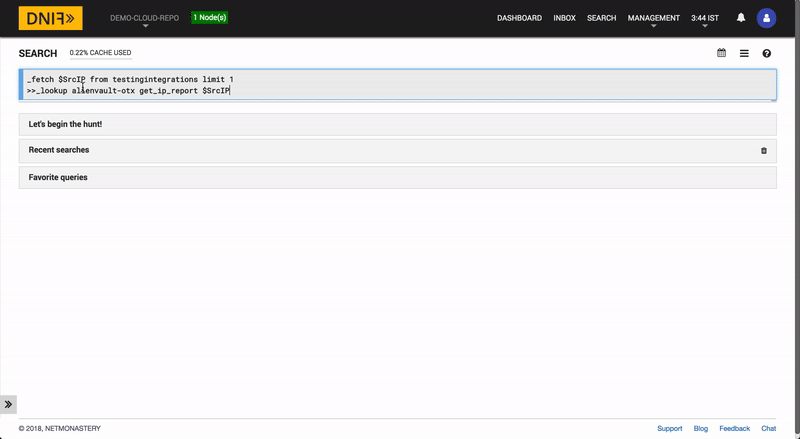](https://youtu.be/d_s55Fo1Qcc)

Click the GIF above to view the high resolution video version.

`testingintegrations` is a DNIF event store that can be uploaded for testing. The lookup call returns output in the following structure for available data

|Field|Description|
|-|-|
| $SrcIP| IP being queried |
| $AVOTXReputationMalActivities| List of malicious activities that have been traced to the given IP |
| $AVOTXReputationMalActivitiesSources| List of sources that have tracked malicious activities on the given IP |
| $AVOTXReputationMalCategories| List of malicious activity categories that have been traced to the given IP |
| $AVOTXReputationThreatScore| The Alien Vault Labs threat score for the given IP |
| $AVOTXReputationThreatTypes| List of threat types of the malicious activities that have been traced to the given IP |
| $AVOTXGeoCity| City name of the given IP's hosting server |
| $AVOTXGeoRegion| Region name of the given IP's hosting server |
| $AVOTXGeoLatitude| Latitudinal location of the given IP's hosting server |
| $AVOTXGeoLongitude| Longitudinal location of the given IP's hosting server |
| $AVOTXGeoContinentCode| Continent code of the given IP's hosting server |
| $AVOTXGeoCountryName| Country of the given IP's hosting server |
| $AVOTXGeoASNCode| Information about the given IP's geographic ASN code. |
| $AVOTXGeoAreaCode| The area code the given IP's hosting server's are located in |
| $AVOTXGeoPostalCode| The postal code the given IP's hosting server's are located in |
| $AVOTXGeoCountryCode| The country code (2 alphanumeric characters) of the IP's hosting server location |
| $AVOTXMalwareCount| Total number of malware samples analyzed by AlienVault Labs which have been observed connecting to the given IP. |
| $AVOTXMalwareSHA256Hashes| SHA256 hashes of malware files analyzed by AlienVault Labs which have been observed connecting to the given IP. |
| $AVOTXUrlHostnames| Hostnames analyzed by AlienVault Labs on the given IP |
| $AVOTXUrlIPs| List of IP addresses of the URLs on the IP |
| $AVOTXUrlActualSize| Count of the total number of URLs found on the given IP |
| $AVOTXUrls| List of URLs on the IP |
| $AVOTXPassiveDnsIPs| List of passive DNS IP addresses that were observed by AlienVault to be pointing to the given IP |
| $AVOTXPassiveDnsCountries| List of countries whose DNS IP addresses were observed by AlienVault to be pointing to the given IP |
| $AVOTXPassiveDnsCount| Total number of passive DNS IP addresses that were observed by AlienVault to be pointing to the given IP |
| $AVOTXPassiveDnsHostnames| List of IPs whose IPs were observed by AlienVault to be pointing to the given IP |

### IP Reputation Report

OTX data on malicious activity observed by AlienVault Labs (IP Reputation).

```
_fetch $SrcIP from testingintegrations limit 1
>>_lookup alienvaultotx get_IP_reputation_report $SrcIP
```

[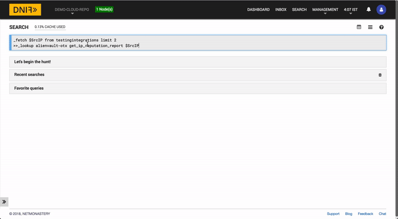](https://youtu.be/Cz_q67WHveU)

Click the GIF above to view the high resolution video version.

`testingintegrations` is a DNIF event store that can be uploaded for testing. The lookup call returns output in the following structure for available data

|Field|Description|
|-|-|
| $SrcIP| IP being queried |
| $AVOTXReputationMalActivities| List of malicious activities that have been traced to the given IP |
| $AVOTXReputationMalActivitiesSources| List of sources that have tracked malicious activities on the given IP |
| $AVOTXReputationMalCategories| List of malicious activity categories that have been traced to the given IP |
| $AVOTXReputationThreatScore| The Alien Vault Labs threat score for the given IP |
| $AVOTXReputationThreatTypes| List of threat types of the malicious activities that have been traced to the given IP |

### IP Geo Report

Registered and inferred geographic information for a given IP (city, country, postal etc).

```
_fetch $SrcIP from testingintegrations limit 1
>>_lookup alienvaultotx get_IP_geo_report $SrcIP
```

[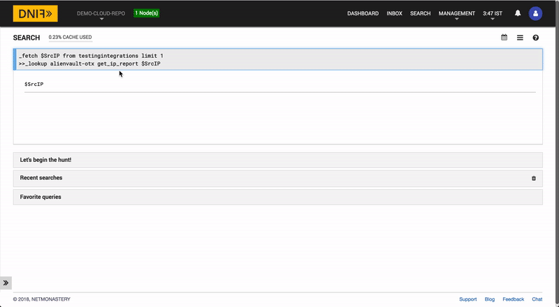](https://youtu.be/NDCOdTqGMCI)

Click the GIF above to view the high resolution video version.

`testingintegrations` is a DNIF event store that can be uploaded for testing. The lookup call returns output in the following structure for available data

|Field|Description|
|-|-|
| $SrcIP| IP being queried |
| $AVOTXGeoCity| City name of the given IP's hosting server |
| $AVOTXGeoRegion| Region name of the given IP's hosting server |
| $AVOTXGeoLatitude| Latitudinal location of the given IP's hosting server |
| $AVOTXGeoLongitude| Longitudinal location of the given IP's hosting server |
| $AVOTXGeoContinentCode| Continent code of the given IP's hosting server |
| $AVOTXGeoCountryName| Country of the given IP's hosting server |
| $AVOTXGeoASNCode| Information about the given IP's geographic ASN code. |
| $AVOTXGeoAreaCode| The area code the given IP's hosting server's are located in |
| $AVOTXGeoPostalCode| The postal code the given IP's hosting server's are located in |
| $AVOTXGeoCountryCode| The country code (2 alphanumeric characters) of the IP's hosting server location |

### IP Malware Report

Malware samples analyzed by AlienVault Labs which have been observed connecting to the given IP.

```
_fetch $SrcIP from testingintegrations limit 1
>>_lookup alienvaultotx get_IP_malware_report $SrcIP
```

[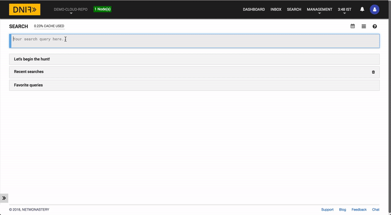](https://youtu.be/tj1IUbGnjUc)

Click the GIF above to view the high resolution video version.

`testingintegrations` is a DNIF event store that can be uploaded for testing. The lookup call returns output in the following structure for available data

|Field|Description|
|-|-|
| $SrcIP| IP being queried |
| $AVOTXMalwareCount| Total number of malware samples analyzed by AlienVault Labs which have been observed connecting to the given IP. |
| $AVOTXMalwareSHA256Hashes| SHA256 hashes of malware files analyzed by AlienVault Labs which have been observed connecting to the given IP. |

### IP URL Report

Report of the URLs analyzed by AlienVault Labs on the given IP.

```
_fetch $SrcIP from testingintegrations limit 1
>>_lookup alienvaultotx get_IP_url_report $SrcIP
```

[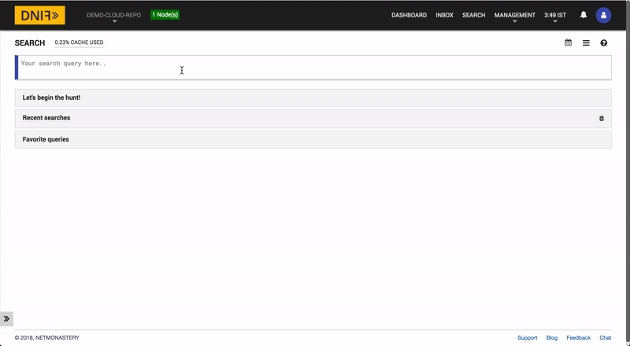](https://youtu.be/O_3QhKm92j4)

Click the GIF above to view the high resolution video version.

`testingintegrations` is a DNIF event store that can be uploaded for testing. The lookup call returns output in the following structure for available data

|Field|Description|
|-|-|
| $SrcIP| IP being queried |
| $AVOTXUrlHostnames| Hostnames analyzed by AlienVault Labs on the given IP |
| $AVOTXUrlIPs| List of IP addresses of the URLs on the IP |
| $AVOTXUrlActualSize| Count of the total number of URLs found on the given IP |
| $AVOTXUrls| List of URLs on the IP |

### IP Passive DNS Report

Passive DNS records observed by AlienVault to be pointing to the given IP.

```
_fetch $SrcIP from testingintegrations limit 1
>>_lookup alienvaultotx get_IP_passivedns_report $SrcIP
```

[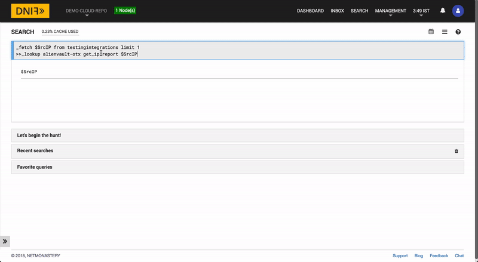](https://youtu.be/ynKjHTBuCfk)

Click the GIF above to view the high resolution video version.

`testingintegrations` is a DNIF event store that can be uploaded for testing. The lookup call returns output in the following structure for available data

|Field|Description|
|-|-|
| $SrcIP| IP being queried |
| $AVOTXPassiveDnsIPs| List of passive DNS IP addresses that were observed by AlienVault to be pointing to the given IP |
| $AVOTXPassiveDnsCountries| List of countries whose DNS IP addresses were observed by AlienVault to be pointing to the given IP |
| $AVOTXPassiveDnsCount| Total number of passive DNS IP addresses that were observed by AlienVault to be pointing to the given IP |
| $AVOTXPassiveDnsHostnames| List of IPs whose IPs were observed by AlienVault to be pointing to the given IP |

## Using the AlienVault OTX API with DNIF  
The AlienVault OTX API can be found on the Alien Vault website at

  https://otx.alienvault.com/api

### Getting started with AlienVault OTX API with DNIF

1. ###### Login to your Data Store, Correlator, and A10 containers.  
   [ACCESS DNIF CONTAINER VIA SSH](https://dnif.it/docs/guides/tutorials/access-dnif-container-via-ssh.html)
2. ##### Move to the `/dnif/<Deployment-key>/lookup_plugins` folder path.
```
$cd /dnif/CnxxxxxxxxxxxxV8/lookup_plugins/
```
3. ###### Clone using the following command
```  
git clone https://github.com/dnif/lookup-alienvault-otx.git alienvault-otx
```
4. ###### Move to the `/dnif/<Deployment-key>/lookup_plugins/alienvault-otx/` folder path and open dnifconfig.yml configuration file     

 Replace the tag: <Add_your_api_key_here> with your AlienVault API key which can be generated at https://otx.alienvault.com

```
lookup_plugin:
  AVOTX_API_KEY: <Add_your_api_key_here>
```
